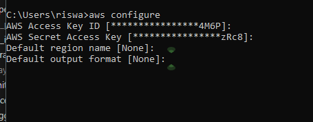
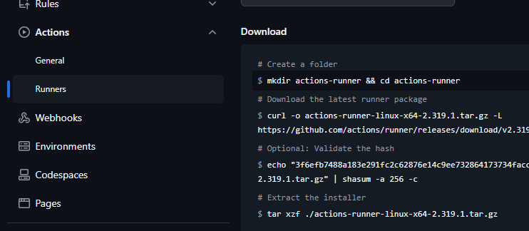

# X-Ray Infection Identification Using Deep Learning

This project is designed to identify infected individuals using their X-ray images. The images are processed using a deep learning model to classify between healthy and infected individuals.

## Table of Contents
1. [Introduction](#introduction)
2. [Project Structure](#project-structure)
3. [Setup Instructions](#setup-instructions)
4. [AWS Configuration](#aws-configuration)
5. [GitHub Repository Secrets](#github-repository-secrets)
6. [EC2 API Reference](#ec2-api-reference)

## Introduction
This project leverages deep learning for X-ray image classification, where the primary goal is to detect infections in the lung. The dataset used can be found on [Kaggle](https://www.kaggle.com/datasets/tolgadincer/labeled-chest-xray-images) for more X-ray images. However, all images used in this project are currently stored in an S3 bucket.

## Project Structure
``` bash
XRay/
├── .git/
├── .github/
│   └── workflows/
│       └── main.yml
├── .vscode/
├── artifacts/
│   ├── 10_02_2024_19_40/
│   └── 10_02_2024_19_44/
├── experiments/
├── logs/
├── test/
├── xray/
│   ├── cloud_Storage/
│   ├── component/
│   │   ├── evaluation.py
│   │   ├── ingestion.py
│   │   ├── model_pusher.py
│   │   ├── model_trainer.py
│   │   └── transformation.py
│   └── ml/
│       ├── model/
│       ├── __init__.py
│       ├── architecture.py
│       └── model_service.py
├── constants/
│   ├── training_pipeline/
│   └── __init__.py
├── entity/
│   ├── artifact_entity.py
│   ├── config_entity.py
│   └── __init__.py
├── xray.egg-info/
│   ├── __init__.py
├── app.py
├── bento.yaml
├── Dockerfile.txt
├── dockerignore.txt
├── init_setup.sh
├── LICENSE
├── main.py
├── README.md
├── requirements.txt
├── requirements_dev.txt
├── setup.cfg
├── tox.ini

```
# s3 bucket 
create a new s3 bucket in the aws and replace  the name in the constants by you bucket name

# I AM use in AWS
create  a New I am user in the AWS with adimistration access to the bucket
and download the Security key csv file
and use it in  the  CLI command as below

# Aws cli

open the default command line and inside the project directory.....

``` bash
aws configure 
```

``` bash
AWS_ACCESS_KEY ==
AWS_SECRET_KEY ==
AWS_REGION == us-east-1
```


# project structure
``` bash
XRay/
├── .git/
├── .github/
│   └── workflows/
│       └── main.yml
├── .vscode/
├── artifacts/
│   ├── 10_02_2024_19_40/
│   └── 10_02_2024_19_44/
├── experiments/
├── logs/
├── test/
├── xray/
│   ├── cloud_Storage/
│   ├── component/
│   │   ├── evaluation.py
│   │   ├── ingestion.py
│   │   ├── model_pusher.py
│   │   ├── model_trainer.py
│   │   └── transformation.py
│   └── ml/
│       ├── model/
│       ├── __init__.py
│       ├── architecture.py
│       └── model_service.py
├── constants/
│   ├── training_pipeline/
│   └── __init__.py
├── entity/
│   ├── artifact_entity.py
│   ├── config_entity.py
│   └── __init__.py
├── xray.egg-info/
│   ├── __init__.py
├── app.py
├── bento.yaml
├── Dockerfile.txt
├── dockerignore.txt
├── init_setup.sh
├── LICENSE
├── main.py
├── README.md
├── requirements.txt
├── requirements_dev.txt
├── setup.cfg
├── tox.ini
```
## Setup Instructions
  Clone the Repository:    

To start using the project, clone the repository using the following command:

``` bash

git clone https://github.com/RisAhamed/XRay-Project.git 
```


  Create a Virtual Environment:  
It is recommended to create a virtual environment for this project to manage dependencies. Use the following command:

``` bash

python -m venv venv
source venv/bin/activate  # On Windows use: venv\Scripts\activate
``` 

  Install Dependencies:   
Install the required packages using the requirements.txt file:

``` bash
Copy code
pip install -r requirements.txt

```

Configure S3 Bucket: 
Upload the dataset to an S3 bucket and replace the following variables in the constants[xray\constants\training_pipeline\__init__.py]:

``` bash

ARTIFACT_DIR: str = 'artifacts' 
BUCKET_NAME: str = "pneumonialungimages" ## your bucket name 
S3_DATA_FOLDER: str = "data" ## your folder name in the bucket

```

  Set AWS Credentials:     
Also, configure your AWS credentials in your local environment.
Upload your AWS access key and secret key in the AWS CLI:

``` bash
aws configure

AWS_ACCESS_KEY == your_aws_access_key
AWS_SECRET_KEY == your_aws_secret_key
AWS_REGION == us-east-1

```




## GitHub Repository Secrets for CI/CD
For CI/CD with GitHub Actions, configure the following secrets in your repository:

``` bash

DOCKER_USERNAME=your_dockerhub_username
DOCKER_PASSWORD=your_dockerhub_password
REGISTRY=docker_registry_url
IMAGE_NAME=image_name_for_container

AWS_ACCESS_KEY_ID=your_aws_access_key_id
AWS_SECRET_ACCESS_KEY=your_aws_secret_key
AWS_REGION=aws_region
``` 
EC2 API Reference
If you’re setting up an EC2 instance, here’s a quick setup guide:

``` bash

sudo apt-get update -y
sudo apt-get upgrade -y

sudo apt-get install \
    ca-certificates \
    curl \
    gnupg \
    lsb-release

curl -fsSL https://download.docker.com/linux/ubuntu/gpg | sudo gpg --dearmor -o /usr/share/keyrings/docker-archive-keyring.gpg

echo \
  "deb [arch=$(dpkg --print-architecture) signed-by=/usr/share/keyrings/docker-archive-keyring.gpg] https://download.docker.com/linux/ubuntu \
  $(lsb_release -cs) stable" | sudo tee /etc/apt/sources.list.d/docker.list > /dev/null

sudo apt-get update
sudo apt-get install docker-ce docker-ce-cli containerd.io -y

sudo systemctl start docker
sudo systemctl enable docker
sudo usermod -aG docker $USER
newgrp docker

docker --version
```


after this copy the command from you github actions runners and paste it in the shell



# Note 
For more acuracy change the Epochs in the constants file and play with the huperparameters
